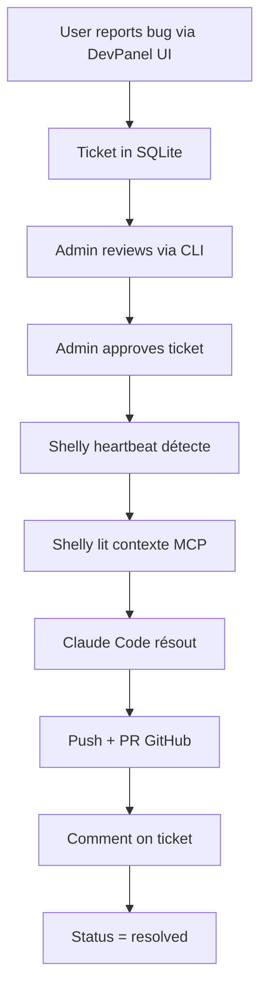

# Shelly — Autonomous Coding Agent

Shelly est l'exécutant autonome de dev-panel, inspiré par OpenClaw. Il résout automatiquement les tickets dev-panel via Telegram.

## Architecture

```
Telegram Bot (claw.js)
    ↓
MCP dev-panel (lecture tickets)
    ↓
Claude Code CLI (résolution)
    ↓
GitHub (push + comment)
```

## Fonctionnalités actuelles (claw.js prototype)

- ✅ Bot Telegram avec commandes `/issues`, `/resolve`, `/resolveall`
- ✅ Liste les issues GitHub assignées
- ✅ Clone repo et exécute `claw` CLI pour résoudre
- ❌ Pas de connexion MCP dev-panel
- ❌ Pas de heartbeat/persistance
- ❌ Pas de gestion d'erreurs robuste

## Améliorations inspirées d'OpenClaw

### 1. Utiliser Claude Code au lieu de Claw CLI

**Pourquoi:** OpenClaw doc recommande `claude --permission-mode bypassPermissions --print`

```javascript
// ❌ Ancien (claw.js)
await exec('claw', [
  '--repo-path', cloneDir,
  '--issue', issueNumber,
  '--auto-commit',
  '--push'
]);

// ✅ Nouveau (avec Claude Code)
await exec('bash', {
  workdir: cloneDir,
  command: `claude --permission-mode bypassPermissions --print "Résoudre l'issue #${issueNumber} du repo. Lire le contexte depuis dev-panel MCP, corriger le code, tester, commit et push."`
});
```

### 2. Processus background avec monitoring

**Pattern OpenClaw:** `bash pty:true workdir:~/project background:true`

```javascript
// Démarrer en background
const sessionId = await exec('bash', {
  workdir: cloneDir,
  background: true,
  command: `claude --permission-mode bypassPermissions --print "Task..."`
});

// Monitorer
setInterval(async () => {
  const status = await checkSession(sessionId);
  if (status.done) {
    bot.sendMessage(chatId, `✅ Issue #${issueNumber} résolue!`);
  }
}, 30000); // Check every 30s
```

### 3. Connexion MCP dev-panel

```javascript
// Avant de résoudre, lire le contexte via MCP
const ticketContext = await mcpClient.call('get_context', {
  ticket_id: issueNumber
});

const prompt = `
Résoudre l'issue #${issueNumber}:
${ticketContext.description}

Contexte technique:
${ticketContext.tech_context}

Screenshots: ${ticketContext.screenshot_url}
`;
```

### 4. Heartbeat autonome (comme OpenClaw)

**Pattern:** Check toutes les 30 minutes s'il y a du travail

```javascript
// Heartbeat: check new tickets
setInterval(async () => {
  const pendingTickets = await mcpClient.call('list_tickets', {
    status: 'approved',
    assigned_to: 'shelly'
  });

  for (const ticket of pendingTickets) {
    await resolveTicket(ticket);
  }
}, 30 * 60 * 1000); // 30 minutes
```

### 5. Git worktree pour isolation (best practice OpenClaw)

**Pourquoi:** Évite de polluer le repo principal

```javascript
// ❌ Ancien: clone dans /tmp
const cloneDir = `/tmp/dev-panel-${Date.now()}`;
await exec(`gh repo clone ${REPO} ${cloneDir}`);

// ✅ Nouveau: git worktree
const worktreeDir = `/tmp/issue-${issueNumber}-${Date.now()}`;
await exec(`git worktree add ${worktreeDir} -b fix/issue-${issueNumber}`);

// Cleanup après
await exec(`git worktree remove ${worktreeDir}`);
```

### 6. Gestion d'erreurs robuste

```javascript
async function resolveIssue(issueNumber, chatId) {
  bot.sendMessage(chatId, `🔧 Démarrage de l'issue #${issueNumber}...`);

  const worktreeDir = `/tmp/issue-${issueNumber}-${Date.now()}`;

  try {
    // 1. Créer worktree
    await exec(`git worktree add ${worktreeDir} -b fix/issue-${issueNumber}`);

    // 2. Lire contexte MCP
    const context = await mcpClient.call('get_context', {
      ticket_id: issueNumber
    });

    // 3. Résoudre avec Claude Code
    const sessionId = await exec('bash', {
      workdir: worktreeDir,
      background: true,
      command: `claude --permission-mode bypassPermissions --print "${buildPrompt(context)}"`
    });

    // 4. Monitorer
    const result = await monitorSession(sessionId, chatId, issueNumber);

    // 5. Update status dans dev-panel
    await mcpClient.call('update_status', {
      ticket_id: issueNumber,
      status: 'resolved',
      resolution: result.summary
    });

    bot.sendMessage(chatId, `✅ Issue #${issueNumber} résolue!\n\nPR: ${result.pr_url}`);

  } catch (error) {
    // Log error + notify
    await mcpClient.call('update_status', {
      ticket_id: issueNumber,
      status: 'failed',
      error: error.message
    });

    bot.sendMessage(chatId, `❌ Échec issue #${issueNumber}: ${error.message}`);
  } finally {
    // Cleanup worktree
    await exec(`git worktree remove --force ${worktreeDir}`).catch(() => {});
  }
}
```

### 7. Batch processing (army pattern)

**Pattern OpenClaw:** Paralléliser les PRs

```javascript
bot.onText(/\/resolveall/, async (msg) => {
  const tickets = await mcpClient.call('list_tickets', {
    status: 'approved'
  });

  bot.sendMessage(msg.chat.id, `🚀 Résolution de ${tickets.length} tickets en parallèle...`);

  // Deploy the army!
  const promises = tickets.map(ticket =>
    resolveIssue(ticket.id, msg.chat.id)
  );

  await Promise.allSettled(promises);

  bot.sendMessage(msg.chat.id, '✅ Batch terminé!');
});
```

## Structure du nouveau Shelly

```
src/agents/
├── shelly/
│   ├── index.js           # Entry point
│   ├── bot.js             # Telegram bot
│   ├── executor.js        # Claude Code execution
│   ├── mcp-client.js      # MCP dev-panel client
│   ├── heartbeat.js       # Autonomous check
│   └── worktree.js        # Git worktree helpers
```

## Variables d'environnement

```bash
# Telegram
TELEGRAM_BOT_TOKEN=xxx
TELEGRAM_CHAT_ID=xxx

# GitHub
GITHUB_TOKEN=xxx
GITHUB_REPO=franckbirba/dev-panel
GITHUB_ASSIGNEE=shelly

# MCP dev-panel
DEVPANEL_MCP_URL=http://localhost:3031/mcp
DEVPANEL_API_KEY=xxx

# Claude Code
ANTHROPIC_API_KEY=xxx
```

## Déploiement Docker

```yaml
# docker-compose.prod.yml
services:
  shelly:
    build:
      context: .
      dockerfile: Dockerfile.shelly
    container_name: shelly-agent
    restart: unless-stopped
    env_file: .env
    volumes:
      - /tmp/shelly-worktrees:/tmp/worktrees
      - ~/.gitconfig:/root/.gitconfig:ro
    depends_on:
      - devpanel
    networks:
      - traefik
```

## Workflow complet



## Prochaines étapes

1. **Refactorer claw.js** en architecture modulaire
2. **Ajouter MCP client** pour lire tickets dev-panel
3. **Remplacer claw CLI** par Claude Code
4. **Implémenter heartbeat** autonome
5. **Dockeriser** pour prod
6. **Tests** end-to-end

## Inspiration OpenClaw

- ✅ Background processes avec monitoring
- ✅ Git worktree pour isolation
- ✅ Claude Code avec `--permission-mode bypassPermissions`
- ✅ Heartbeat autonome
- ✅ Batch parallel processing
- ✅ Gestion d'erreurs robuste
- ✅ Cleanup automatique

## Notes

- **Pas de PTY pour Claude Code** (contrairement à Codex)
- **workdir crucial** pour isolation
- **MCP dev-panel** est la source de vérité
- **Telegram** juste pour monitoring/control
