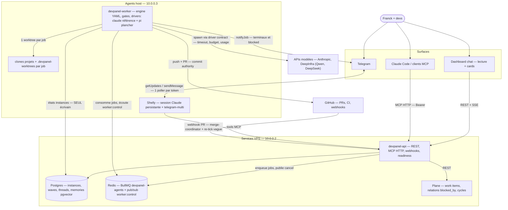
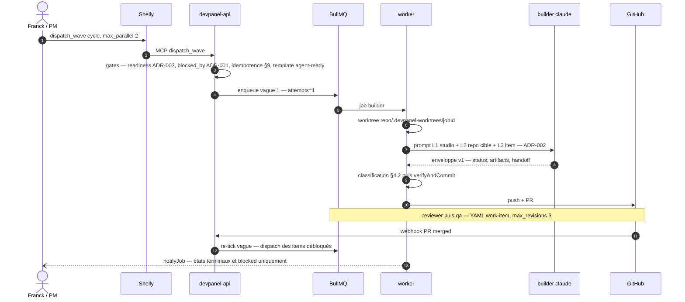
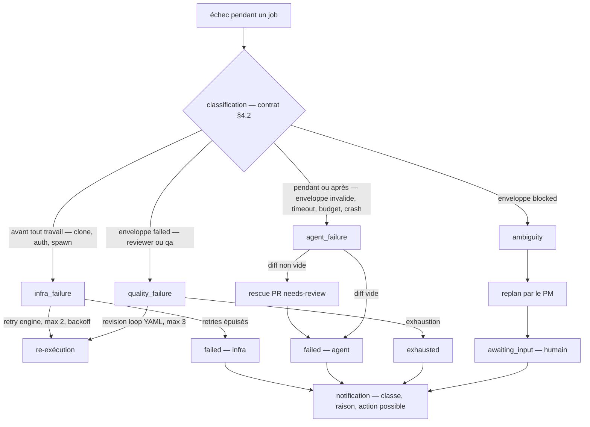
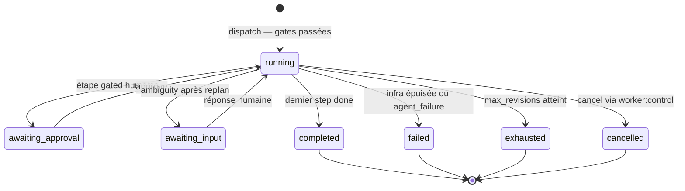
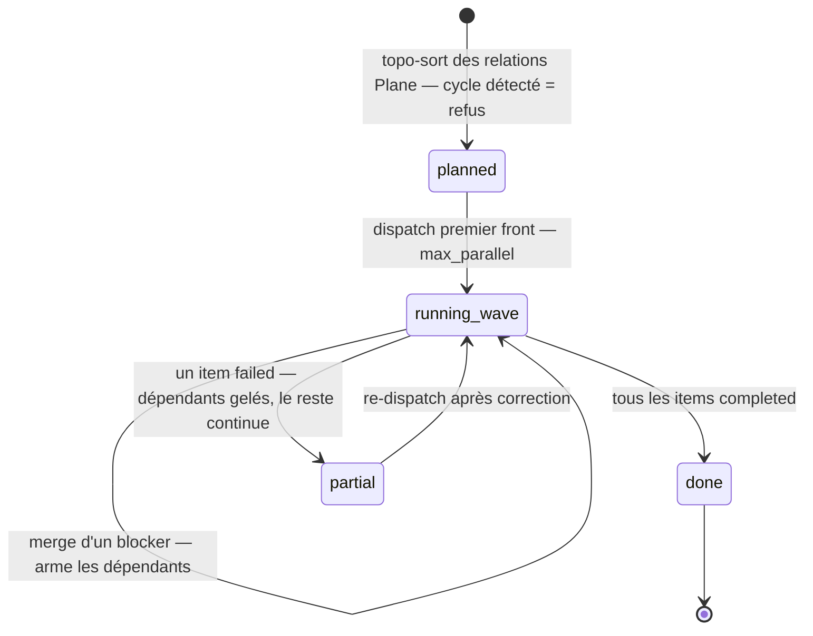
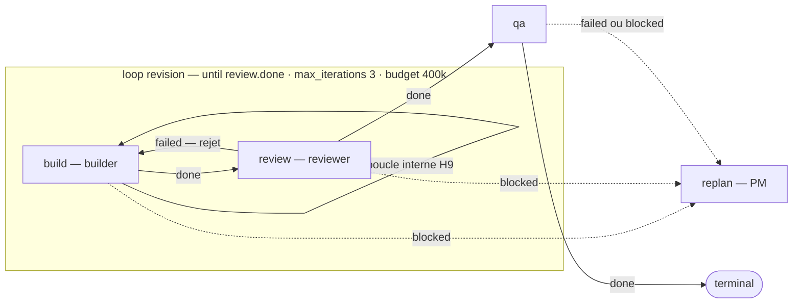

# Architecture devpanl — cible v2

**Statut : DRAFT — accompagne `engine-contract.md` (v1.1) + ADR-001→004 (ADR-004 v2).** Chaque flèche de ces schémas est gouvernée par une section de contrat (table des frontières en bas). Le moteur est **model-agnostic par contrat** : deux drivers au chemin critique — claude (référence) et pi/Qwen (plancher) — et le bench se lit en matrice, « moteur prêt » = colonne plancher verte. Ce qui n'apparaît pas ici (dashboard bridge DEVPA-204, container driver, goose/mini-swe) est hors chemin critique par décision, pas par oubli.

---

## Vue 1 — Conteneurs et frontières

Trois invariants portés par cette vue : **le worker est le seul écrivain** des états (API et Shelly demandent, n'écrivent pas) ; **un seul poller Telegram par token** (Shelly) ; **l'API ne fait jamais de SSH** — les checks agents-host passent par le canal worker (le crash F2 de l'audit est une violation de cet invariant).

## Vue 2 — Cycle de vie d'un work item dans une vague

Le re-tick est **événementiel** (webhook merge existant), jamais du polling. La vague avance au **merge** du blocker, pas au QA-done — pour un refacto, c'est l'état du repo qui fait foi (ADR-001, question ouverte n°2).

## Vue 3 — Taxonomie d'échec (remplace retries BullMQ × revisions × replan × rescue empilés)

Règle unique : **une classe = un mécanisme = une borne.** BullMQ passe à `attempts: 1` — c'est l'engine qui décide des retries parce que lui seul sait classifier. Un `agent_failure` n'est **jamais** re-exécuté automatiquement (le 11/08 : 18 exécutions payantes pour 3 items, zéro merge).

## Vue 4 — Machine à états d'une instance

Invariant anti-zombie (§3.2 + §8) : tout état live exige un job BullMQ vivant **et** un `last_event_at` frais ; sinon la réconciliation au boot le passe en `failed — stale_reconciled`. `cancel` est accepté depuis n'importe quel état live (y compris `awaiting_*`). Re-dispatch autorisé **uniquement** depuis un état terminal (§9) — les rows « running » de mai encore visibles en août sont exactement ce que ces deux règles interdisent.

## Vue 5 — Cycle de vie d'une vague (ADR-001)

## Vue 6 — Modèle d'exécution intra-item : graphe explicite, boucles bornées (ADR-006)

Deux niveaux de boucle : **interne** (harness H9 — le builder itère test→fix dans sa session, le moins cher, décisif pour le modèle plancher) et **externe** (engine — cycle entre agents, nommé, avec `until` + `max_iterations` + budget PAR boucle). Règle de validation au chargement : **tout cycle du graphe doit appartenir à une boucle déclarée, sinon le YAML est rejeté** — la terminaison redevient démontrable. Les prédicats mécanisables sont vérifiés par le worker lui-même (`tests_green` = il exécute `commands.test`), pas déclarés par l'agent — même philosophie que le commit-authority.

## Table des frontières — quelle flèche, quel contrat

| Frontière | Gouvernée par |
|---|---|
| Gates au dispatch (readiness, blocked_by, idempotence, agent-ready) | ADR-003 · ADR-001 · contrat §9 |
| Composition du prompt (L1/L2/L3) | ADR-002 §2 |
| Enveloppe de sortie agent | ADR-002 §1 · contrat §3.1 |
| Classification, retries, rescue | contrat §4 |
| Timeout / budget du spawn | contrat §5 · §6 |
| Cancel (`worker:control`) | contrat §7 |
| Réconciliation au boot | contrat §8 |
| Commit / push / PR (autorité) | ADR-002 §3 — worker only |
| Exécution d'un job (boucle d'outils, édits, permissions, usage) | ADR-005 — harness contract H1–H9 |
| Modèle d'exécution intra-item (graphe, boucles, prédicats) | ADR-006 — cycle non déclaré = rejet au chargement |
| Choix du driver | ADR-004 v2 — driver contract ; claude référence + pi plancher, multi-tier par rôle |
| Dispatch automatique (puller) | contrat §10 — OFF par défaut |
| Conformité globale | bench D1–D6 × {claude, pi} = contrat §11 — « prêt » = colonne plancher verte |
