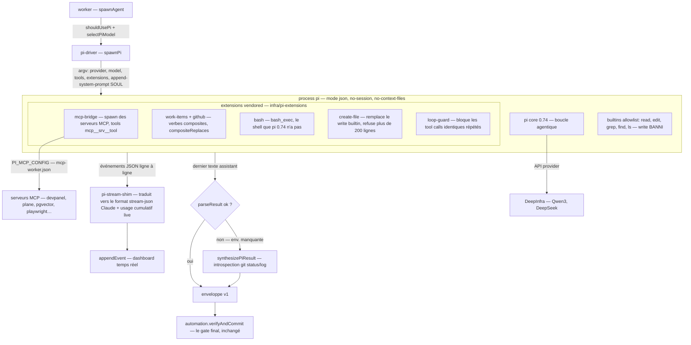
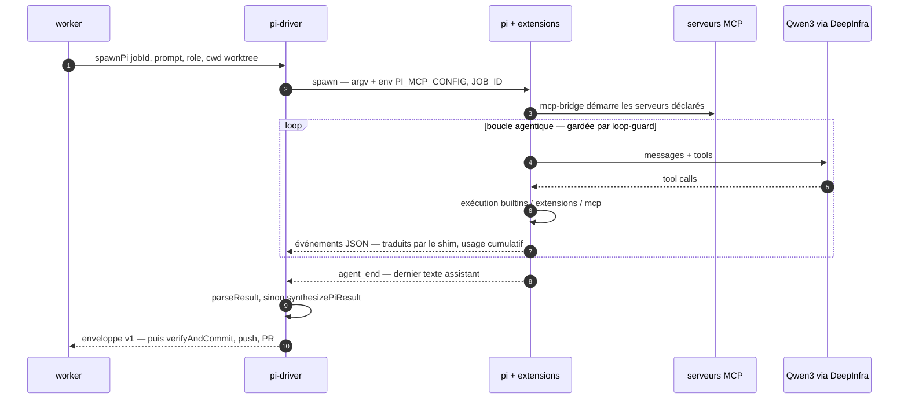

# Harness pi — architecture

**Statut : DRAFT — le doc d'archi du harness retenu (ADR-005, O1 « on investit sur pi », 2026-08-18).**
Ancré dans le code réel : `src/worker/pi-driver.js` (413 l.), `src/worker/pi-stream-shim.js` (197 l.), `infra/pi-extensions/` (7 extensions, ~2 400 LOC TS). Réfs : ADR-004 v2 (driver contract), ADR-006 (H9), engine-contract v1.1.

---

## 1. Anatomie

Points de design importants, tous déjà en place :

- **Le worker possède le prompt.** `--no-session --no-context-files --no-skills` : pi n'auto-découvre rien ; le SOUL (L1/L2 à terme, ADR-002) arrive par `--append-system-prompt`, le contexte item par `-p`. Pas de double source d'instructions.
- **Une capacité = une seule surface.** Les extensions composites (`work-items`, `github`) déclarent `pi.compositeReplaces` dans leur package.json ; mcp-bridge masque les primitives MCP brutes équivalentes. Le modèle ne voit jamais deux outils pour la même chose. (Motivé par le canary ZENO-339 : Qwen3 a brûlé 24 retries à échapper des apostrophes françaises dans `gh pr create` en bash — d'où le tool structuré `gh_pr_create`.)
- **Le write builtin est banni** (`--tools read,edit,grep,find,ls`) : outil whole-file calibré Claude, catastrophique pour un coder plancher. Remplacé par `create-file` (refuse > 200 lignes et le pseudo-JSON — l'échec exact du job 4168 / DEVPA-225). Les modifications passent par `edit` builtin, **Aider-style SEARCH/REPLACE** — le spike du 2026-05-09 (24× read, 12× edit corrects, ~0,0001 $) est la raison du choix de pi.
- **La synthèse d'enveloppe est un filet, pas une excuse.** Quand le modèle lâche l'enveloppe, `synthesizePiResult` la reconstruit depuis l'état git observable (porcelain + commits ahead) — et `verifyAndCommit` reste le juge : une enveloppe synthétisée `done` sans diff réel ne shippe rien.

## 2. Flux d'un job

Contrat externe du driver (identique à mini-swe/goose — c'est la base de fait du **driver contract** ADR-004 à formaliser) : résout avec le texte final sur exit 0, rejette avec le tail stderr sinon, s'enregistre dans `activeProcesses` (cancel), logge stderr dans `agent-logs/<job>.err.log`, persiste chaque événement via `appendEvent`.

## 3. État réel vs H1–H9 (corrigé après lecture du code)

| Cap. | État réel | Preuve code | Chantier C7 |
|---|---|---|---|
| H1 boucle d'outils | bon — canary vert, loop-guard en garde-fou | spike 05-09 ; `loop-guard/index.ts` | bencher |
| H2 édits | **meilleur que craint** — `edit` builtin Aider-style S/R validé au spike ; le false-flag 70 KB était qwen-code | `pi-driver.js:18-31` | stress-test : gros fichiers, multi-hunk, apostrophes FR |
| H3 sortie structurée | **gap mesuré** — pas de json_schema en 0.74, Qwen3 lâche l'enveloppe ~70 % des longs runs (job 4771 : XML de tool_call halluciné) ; mitigé par la synthèse | `pi-driver.js:48-68` | **extension `submit_result`** : l'enveloppe devient un tool call (fiable) au lieu d'un « dernier message JSON » (fragile) + retry-with-feedback §4.2 |
| H4 permissions | à auditer — les jobs tournent headless `-p` ; le spam du 11/08 venait du chemin Shelly-pi | — | politique zéro-prompt vérifiée + sandbox container à terme |
| H5 contexte | gap probable — one-shot sans compaction | `--no-session` | auditer sur les gros items [REFACTO] |
| H6 usage | **partiel bon** — pi émet l'usage cumulatif par message ; le shim le suit en live | `pi-stream-shim.js:39,91,183` | enforcement mid-run du budget §6 dans `onTranslatedEvent` → kill au dépassement. Petit diff. |
| H7 MCP | ✅ le point fort | `mcp-bridge` 496 LOC + compositeReplaces | — |
| H8 env | ⚠️ **fuite réelle** : `env: {...process.env}` → le `NODE_ENV=production` du host fuit dans les jobs (le trap lockfile du 11/08) ; PATH déjà pinné | `pi-driver.js:251-263` | sanitize : NODE_ENV forcé, git identity injectée. ~5 lignes + test. |
| H9 boucle interne | à construire | base : ext `bash` + `commands.test` (ADR-003 R1) | après le format ADR-006 |

## 4. Chantiers C7, priorisés

1. **`submit_result` (H3)** — la plus forte réduction du taux de synthèse : un tool call dédié pour clore, que loop-guard reconnaît déjà comme marqueur de terminaison propre. C'est aussi ce qui rend le retry-with-feedback (§4.2) presque toujours inutile.
2. **Budget mid-run (H6)** — brancher `BUDGET_TOKENS_<ROLE>` sur l'usage cumulatif du shim, kill + `agent_failure reason=budget`. Le contrat §6 devient réel sur pi avant même de l'être sur claude.
3. **Env sanitize (H8)** — corrige le trap NODE_ENV à la source pour tous les jobs pi. Quasi gratuit.
4. **Stress-test H2** — protocole : fichier 70 KB, éditions multi-hunk, contenu FR avec apostrophes, vérification post-application. Verdict écrit en mémoire + ce doc.
5. **Audit H4/H5** — zéro-prompt headless vérifié ; comportement sur item long documenté.
6. **H9** — après validation du format boucles (ADR-006).

## 5. Ce que ce doc ne couvre pas

Pi-Shelly (le chemin conversationnel avec `telegram-out`) — même binaire, autre topologie (loop long-vivant, un poller par token) : documenté dans CLAUDE.md § « Quota fallback ». Ici on ne parle que du harness des **jobs éphémères**.
