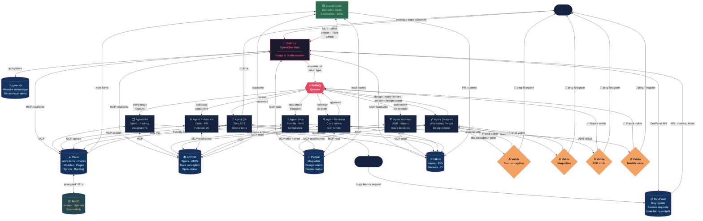

```mermaid
flowchart TD
%% ─── INPUTS ───────────────────────────────────────────────────────────────
FRANCK(["👤 Franck<br/>(Telegram)"])
USERS(["👥 Users<br/>(DevPanel Widget)"])

%% ─── HUB ──────────────────────────────────────────────────────────────────
SHELLY["🦞 SHELLY<br/>OpenClaw Hub<br/>─────────────<br/>Triage & Orchestration"]

%% ─── SOURCES DE CONTEXTE ──────────────────────────────────────────────────
AFFINE[("📚 AFFiNE<br/>Specs · ADRs<br/>Docs conception<br/>Sprint status")]
PENPOT[("🎨 Penpot<br/>Maquettes<br/>Design tokens<br/>Frames status")]
PLANE[("✈️ Plane<br/>Work items · Cycles<br/>Modules · Pages<br/>Sprints · Backlog")]
DEVPANEL[("📋 DevPanel<br/>Bug reports<br/>Feature requests<br/>(user-facing widget)")]
GITHUB[("🐙 GitHub<br/>Issues · PRs<br/>Reviews · CI")]
PGVECTOR[("🧠 pgvector<br/>Mémoire sémantique<br/>Décisions passées")]
MINIO[("📦 MinIO<br/>Assets · Uploads<br/>Screenshots")]

%% ─── BULLMQ ────────────────────────────────────────────────────────────────
BULLMQ{{"⚡ BullMQ<br/>Queues"}}

%% ─── AGENTS ────────────────────────────────────────────────────────────────
PM["🗂️ Agent PM<br/>Sprint · Backlog<br/>Assignations"]
ARCHITECT["🏗️ Agent Architect<br/>ADR · Impact<br/>Stack decisions"]
DESIGNER["🖌️ Agent Designer<br/>Wireframes Penpot<br/>Design tokens"]
BUILDER["⚙️ Agent Builder ×N<br/>Code · PR<br/>Fullstack JS"]
REVIEWER["🔍 Agent Reviewer<br/>Code review<br/>Conformité"]
QA["🧪 Agent QA<br/>Tests E2E<br/>Smoke tests"]
SECU["🔐 Agent Sécu<br/>Permify · Auth<br/>Compliance"]

%% ─── CLAUDE CODE ───────────────────────────────────────────────────────────
CLAUDECODE["⌨️ Claude Code<br/>Exécution locale<br/>Commands · Skills"]

%% ─── VALIDATIONS HUMAINES ──────────────────────────────────────────────────
VAL_CONCEPTION{"⚠️ Valide<br/>Doc conception"}
VAL_MAQUETTE{"⚠️ Valide<br/>Maquettes"}
VAL_ARCHI{"⚠️ Valide<br/>ADR archi"}
VAL_SECU{"⚠️ Valide<br/>Modèle sécu"}

%% ─── INPUTS → SHELLY ───────────────────────────────────────────────────────
FRANCK -->|"message toute la journée"| SHELLY
USERS -->|"bug / feature request"| DEVPANEL
DEVPANEL -->|"API : nouveau ticket"| SHELLY

%% ─── SHELLY ↔ SOURCES ──────────────────────────────────────────────────────
SHELLY <-->|"MCP read/write"| AFFINE
SHELLY <-->|"MCP read"| PENPOT
SHELLY <-->|"MCP read/write"| PLANE
SHELLY <-->|"MCP read/write"| GITHUB
SHELLY <-->|"query/store"| PGVECTOR
SHELLY -->|"DevPanel API"| DEVPANEL

%% ─── SHELLY → BULLMQ ───────────────────────────────────────────────────────
SHELLY -->|"enqueue job\nselon type"| BULLMQ

%% ─── BULLMQ → AGENTS ───────────────────────────────────────────────────────
BULLMQ -->|"shelly:triage<br/>toujours"| PM
BULLMQ -->|"arch:review<br/>on-demand"| ARCHITECT
BULLMQ -->|"design:sprint<br/>on-demand"| DESIGNER
BULLMQ -->|"build:task<br/>concurrent"| BUILDER
BULLMQ -->|"review:pr<br/>on push"| REVIEWER
BULLMQ -->|"qa:run<br/>on merge"| QA
BULLMQ -->|"secu:check<br/>bloquant"| SECU

%% ─── AGENTS ↔ SOURCES ──────────────────────────────────────────────────────
PM <-->|"MCP"| AFFINE
PM <-->|"MCP"| PLANE
PM -->|"MCP"| GITHUB

ARCHITECT <-->|"MCP write ADR"| AFFINE
ARCHITECT -->|"MCP read"| GITHUB

DESIGNER <-->|"MCP write frames"| PENPOT
DESIGNER <-->|"MCP read specs"| AFFINE

BUILDER <-->|"MCP read specs"| AFFINE
BUILDER <-->|"MCP read frames"| PENPOT
BUILDER <-->|"MCP update"| PLANE
BUILDER -->|"PR"| GITHUB

REVIEWER <-->|"MCP"| GITHUB
REVIEWER <-->|"MCP read"| AFFINE
REVIEWER <-->|"MCP read"| PENPOT

QA <-->|"MCP"| GITHUB
QA <-->|"MCP update"| PLANE

SECU <-->|"MCP"| AFFINE
SECU <-->|"Permify API"| PLANE

%% ─── CLAUDE CODE ────────────────────────────────────────────────────────────
CLAUDECODE <-->|"MCP : affine<br/>penpot · plane<br/>github"| SHELLY
CLAUDECODE <-->|"read/write"| AFFINE
CLAUDECODE <-->|"read frames"| PENPOT
CLAUDECODE <-->|"work items"| PLANE
CLAUDECODE -->|"PR / commit"| GITHUB

%% ─── LOOPS DESIGN ───────────────────────────────────────────────────────────
DESIGNER -->|"doc conception prête"| VAL_CONCEPTION
VAL_CONCEPTION -->|"✅ Franck valide"| DESIGNER
VAL_CONCEPTION -->|"🔴 ping Telegram"| FRANCK

DESIGNER -->|"maquettes prêtes"| VAL_MAQUETTE
VAL_MAQUETTE -->|"✅ Franck valide"| DESIGNER
VAL_MAQUETTE -->|"🔴 ping Telegram"| FRANCK

DESIGNER -->|"ready-for-dev<br/>+ design tokens"| BULLMQ

%% ─── LOOPS ARCHI ────────────────────────────────────────────────────────────
ARCHITECT -->|"ADR rédigé"| VAL_ARCHI
VAL_ARCHI -->|"✅ Franck valide"| BULLMQ
VAL_ARCHI -->|"🔴 ping Telegram"| FRANCK

%% ─── LOOPS SECU ─────────────────────────────────────────────────────────────
SECU -->|"analyse faite"| VAL_SECU
VAL_SECU -->|"✅ Franck valide"| BULLMQ
VAL_SECU -->|"🔴 ping Telegram"| FRANCK

%% ─── FIN DE LOOP ────────────────────────────────────────────────────────────
REVIEWER -->|"approved"| BULLMQ
QA -->|"tests OK"| PLANE
QA -->|"notifie user"| USERS
QA -->|"✅ done"| FRANCK

%% ─── INFRA ──────────────────────────────────────────────────────────────────
PLANE <-->|"presigned URLs"| MINIO

%% ─── STYLES ─────────────────────────────────────────────────────────────────
classDef hub fill:#1a1a2e,color:#e94560,stroke:#e94560,stroke-width:2px,font-weight:bold
classDef human fill:#16213e,color:#0f3460,stroke:#0f3460
classDef source fill:#0f3460,color:#fff,stroke:#e94560
classDef queue fill:#e94560,color:#fff,stroke:#c73652,font-weight:bold
classDef agent fill:#16213e,color:#a8dadc,stroke:#457b9d
classDef validation fill:#f4a261,color:#1a1a2e,stroke:#e76f51,font-weight:bold
classDef code fill:#2d6a4f,color:#95d5b2,stroke:#52b788
classDef storage fill:#264653,color:#e9c46a,stroke:#2a9d8f

class SHELLY hub
class FRANCK,USERS human
class AFFINE,PENPOT,PLANE,DEVPANEL,GITHUB,PGVECTOR source
class BULLMQ queue
class PM,ARCHITECT,DESIGNER,BUILDER,REVIEWER,QA,SECU agent
class VAL_CONCEPTION,VAL_MAQUETTE,VAL_ARCHI,VAL_SECU validation
class CLAUDECODE code
class MINIO storage
```
