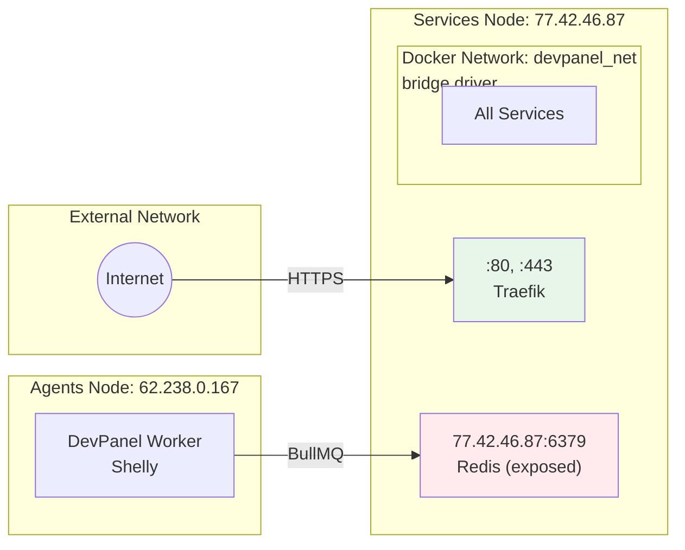
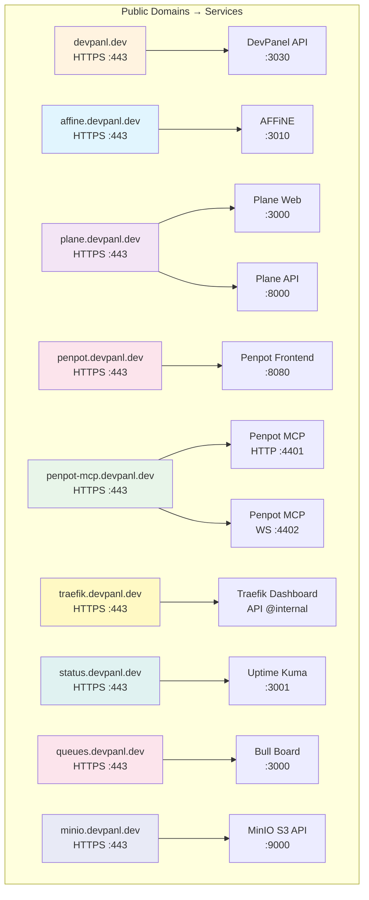
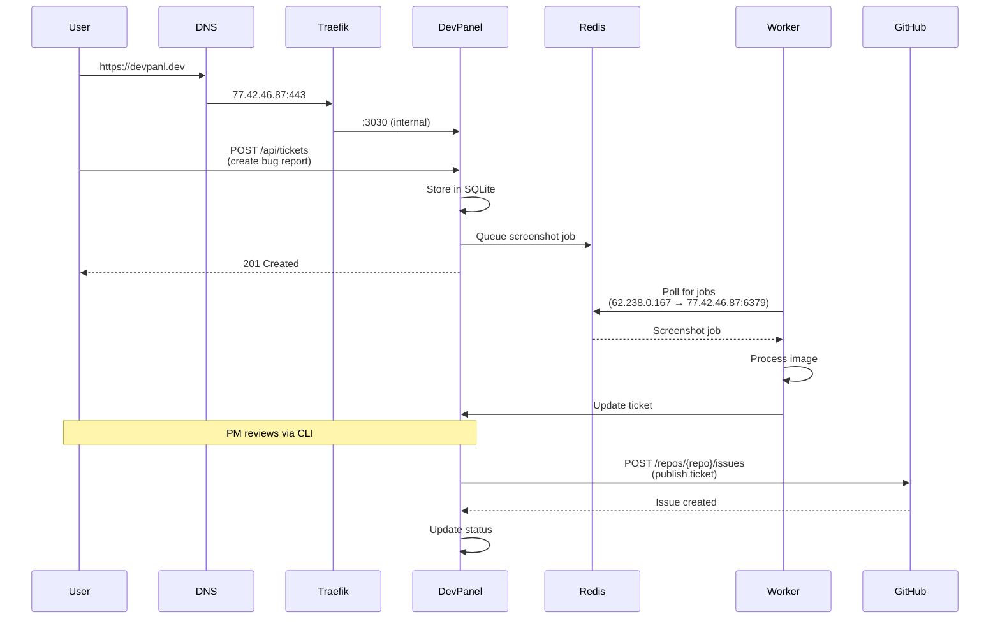
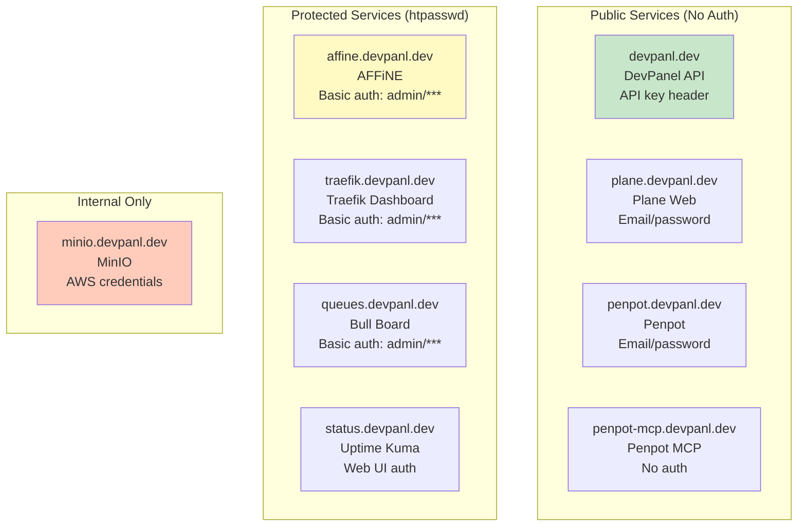
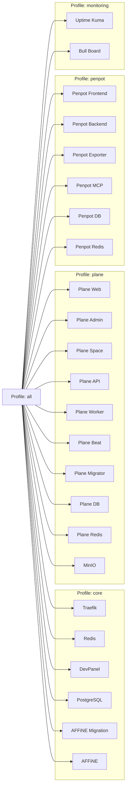
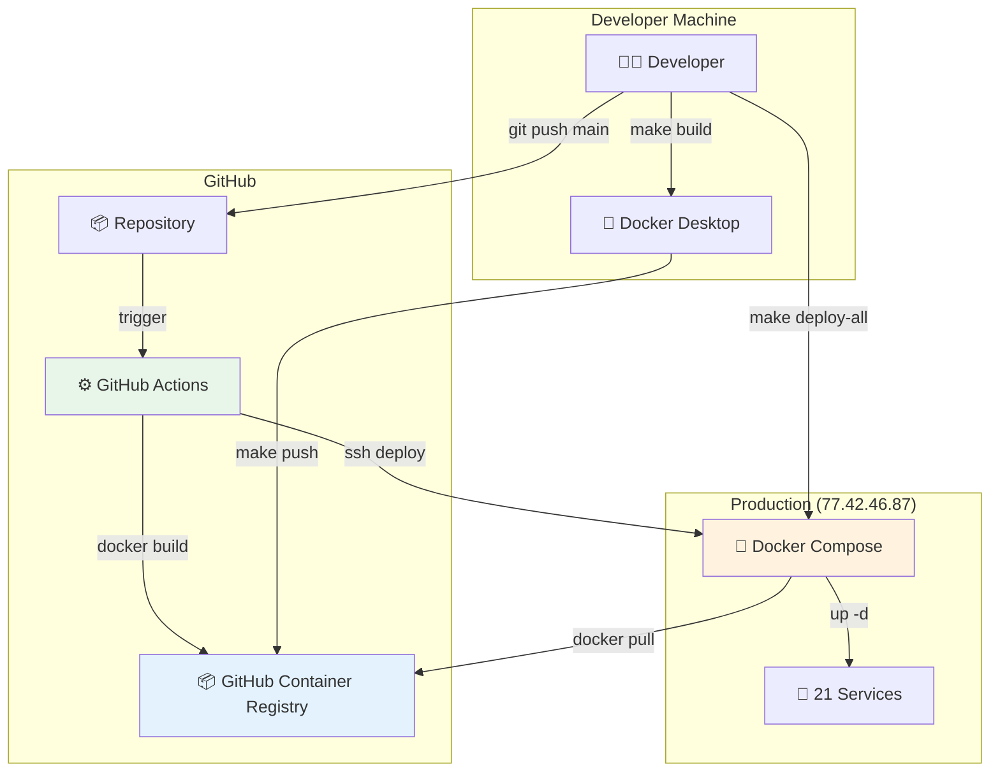

# Infrastructure Architecture

Complete production infrastructure diagram with all services, networks, ports, and domains.

## Overview Diagram

```mermaid
graph TB
    subgraph Internet
        Users[👥 Users]
        GitHub[🐙 GitHub]
    end

    subgraph "Hetzner Services Node<br/>77.42.46.87"
        subgraph "Network: devpanel_net"
            Traefik[🔀 Traefik<br/>:80, :443]

            subgraph "Core Stack"
                DevPanel[🎯 DevPanel API<br/>:3030]
                Redis[📦 Redis<br/>77.42.46.87:6379]
                Postgres[🐘 PostgreSQL<br/>:5432]
                AFFiNE[📝 AFFiNE<br/>:3010]
                AFFiNEMigration[🔄 AFFiNE Migration]
            end

            subgraph "Plane Stack"
                PlaneWeb[🌐 Plane Web<br/>:3000]
                PlaneAdmin[⚙️ Plane Admin<br/>:3000]
                PlaneSpace[🚀 Plane Space<br/>:3000]
                PlaneAPI[🔌 Plane API<br/>:8000]
                PlaneWorker[👷 Plane Worker]
                PlaneBeat[⏰ Plane Beat]
                PlaneMigrator[🔄 Plane Migrator]
                PlaneDB[🐘 Plane DB<br/>:5432]
                PlaneRedis[📦 Plane Redis<br/>:6379]
                MinIO[💾 MinIO<br/>:9000, :9001]
            end

            subgraph "Penpot Stack"
                PenpotFrontend[🎨 Penpot Frontend<br/>:8080]
                PenpotBackend[🔧 Penpot Backend]
                PenpotExporter[📤 Penpot Exporter]
                PenpotMCP[🤖 Penpot MCP<br/>:4401, :4402]
                PenpotDB[🐘 Penpot DB<br/>:5432]
                PenpotRedis[📦 Penpot Redis<br/>:6379]
            end

            subgraph "Monitoring Stack"
                UptimeKuma[📊 Uptime Kuma<br/>:3001]
                BullBoard[📈 Bull Board<br/>:3000]
            end
        end

        Volumes[(💿 Docker Volumes)]
    end

    subgraph "Hetzner Agents Node<br/>62.238.0.167"
        Worker[👷 DevPanel Worker<br/>systemd]
        Shelly[🐚 Shelly<br/>Claude Code + Telegram]
    end

    subgraph "DNS: devpanl.dev"
        D1[devpanl.dev]
        D2[affine.devpanl.dev]
        D3[plane.devpanl.dev]
        D4[penpot.devpanl.dev]
        D5[penpot-mcp.devpanl.dev]
        D6[traefik.devpanl.dev]
        D7[status.devpanl.dev]
        D8[queues.devpanl.dev]
        D9[minio.devpanl.dev]
    end

    Users -->|HTTPS :443| D1 & D2 & D3 & D4 & D5 & D6 & D7 & D8 & D9
    D1 & D2 & D3 & D4 & D5 & D6 & D7 & D8 & D9 -->|SSL Termination| Traefik

    Traefik -->|/| DevPanel
    Traefik -->|/| AFFiNE
    Traefik -->|/| PlaneWeb
    Traefik -->|/god-mode| PlaneAdmin
    Traefik -->|/spaces| PlaneSpace
    Traefik -->|/api, /auth| PlaneAPI
    Traefik -->|/| PenpotFrontend
    Traefik -->|HTTP + WS| PenpotMCP
    Traefik -->|/| UptimeKuma
    Traefik -->|/| BullBoard
    Traefik -->|S3 API| MinIO
    Traefik -->|Dashboard| Traefik

    DevPanel -->|Queue Jobs| Redis
    Worker -->|Process Jobs| Redis
    DevPanel -->|Sync Issues| GitHub

    AFFiNE --> Postgres
    AFFiNE --> Redis
    AFFiNEMigration --> Postgres
    AFFiNEMigration --> Redis

    PlaneWeb --> PlaneAPI
    PlaneAdmin --> PlaneAPI
    PlaneSpace --> PlaneAPI
    PlaneAPI --> PlaneDB
    PlaneAPI --> PlaneRedis
    PlaneAPI -->|S3| MinIO
    PlaneWorker --> PlaneDB
    PlaneWorker --> PlaneRedis
    PlaneWorker -->|S3| MinIO
    PlaneBeat --> PlaneRedis
    PlaneMigrator --> PlaneDB

    PenpotFrontend --> PenpotBackend
    PenpotFrontend --> PenpotExporter
    PenpotBackend --> PenpotDB
    PenpotBackend --> PenpotRedis

    BullBoard --> Redis

    DevPanel -.->|Storage| Volumes
    Postgres -.->|Data| Volumes
    AFFiNE -.->|Storage| Volumes
    PlaneDB -.->|Data| Volumes
    PlaneRedis -.->|Data| Volumes
    MinIO -.->|Data| Volumes
    PenpotDB -.->|Data| Volumes
    PenpotRedis -.->|Data| Volumes
    PenpotFrontend -.->|Assets| Volumes
    UptimeKuma -.->|Data| Volumes
    Traefik -.->|Certs| Volumes

    style Traefik fill:#e8f5e9
    style DevPanel fill:#fff3e0
    style Redis fill:#ffebee
    style Worker fill:#fff3e0
    style Shelly fill:#e3f2fd
```

## Network Topology

## Service Mapping

## Port Reference

```mermaid
graph TB
    subgraph "External Ports (Services Node: 77.42.46.87)"
        P80[":80 HTTP<br/>→ redirect to :443"]
        P443[":443 HTTPS<br/>Traefik SSL termination"]
        P6379["77.42.46.87:6379<br/>Redis (BullMQ)<br/>exposed for agents node"]
    end

    subgraph "Internal Container Ports"
        C3030[":3030 DevPanel API"]
        C3010[":3010 AFFiNE"]
        C3000A[":3000 Plane Web/Admin/Space"]
        C8000[":8000 Plane API"]
        C8080[":8080 Penpot Frontend"]
        C4401[":4401 Penpot MCP HTTP"]
        C4402[":4402 Penpot MCP WebSocket"]
        C3001[":3001 Uptime Kuma"]
        C3000B[":3000 Bull Board"]
        C9000[":9000 MinIO S3 API"]
        C9001[":9001 MinIO Console"]
        C5432A[":5432 PostgreSQL (AFFiNE)"]
        C5432B[":5432 Plane DB"]
        C5432C[":5432 Penpot DB"]
        C6379A[":6379 Redis (core)"]
        C6379B[":6379 Plane Redis"]
        C6379C[":6379 Penpot Redis"]
    end

    P80 -.->|redirect| P443
    P443 --> C3030
    P443 --> C3010
    P443 --> C3000A
    P443 --> C8000
    P443 --> C8080
    P443 --> C4401
    P443 --> C4402
    P443 --> C3001
    P443 --> C3000B
    P443 --> C9000

    style P80 fill:#ffcdd2
    style P443 fill:#c8e6c9
    style P6379 fill:#fff9c4
```

## Data Flow

## Volume Mounts

```mermaid
graph TD
    subgraph "Docker Volumes (Services Node)"
        V1[traefik-certs<br/>Let's Encrypt certificates]
        V2[redis-data<br/>BullMQ queue data]
        V3[postgres-data<br/>AFFiNE database]
        V4[affine-config<br/>AFFiNE configuration]
        V5[affine-storage<br/>AFFiNE files]
        V6[plane-pgdata<br/>Plane database]
        V7[plane-redisdata<br/>Plane cache]
        V8[plane-minio-data<br/>Plane file uploads]
        V9[penpot-assets<br/>Penpot designs]
        V10[penpot-plugins<br/>Penpot plugins]
        V11[penpot-pgdata<br/>Penpot database]
        V12[uptime-kuma-data<br/>Monitoring data]
    end

    subgraph "Host Mounts"
        H1[./storage<br/>DevPanel SQLite + screenshots]
        H2[./dist<br/>DevPanel dashboard build]
        H3[./infra/config/traefik.yml<br/>Traefik static config]
        H4[./infra/config/dynamic.yml<br/>Traefik dynamic config]
        H5[./infra/config/.htpasswd<br/>Basic auth]
        H6[./infra/nginx/spa.conf<br/>Plane SPA routing]
    end

    V1 -.->|mounted in| Traefik
    V2 -.->|mounted in| Redis
    V3 -.->|mounted in| Postgres
    H1 -.->|mounted in| DevPanel
    H3 & H4 & H5 -.->|mounted in| Traefik
    H6 -.->|mounted in| PlaneWeb[Plane Web/Admin/Space]

    style V1 fill:#e8f5e9
    style H1 fill:#fff3e0
    style H3 fill:#e3f2fd
```

## Authentication Flow

## Docker Compose Profiles

## Deployment Architecture

## Summary Tables

### Services Node (77.42.46.87)

| Service | Container Port | External Port | Domain | Auth |
|---------|---------------|---------------|---------|------|
| Traefik | - | 80, 443 | traefik.devpanl.dev | htpasswd |
| DevPanel | 3030 | via Traefik | devpanl.dev | API key |
| AFFiNE | 3010 | via Traefik | affine.devpanl.dev | htpasswd |
| Redis | 6379 | 77.42.46.87:6379 | - | none (exposed) |
| Plane Web | 3000 | via Traefik | plane.devpanl.dev | email/pass |
| Plane API | 8000 | via Traefik | plane.devpanl.dev/api | - |
| Penpot Frontend | 8080 | via Traefik | penpot.devpanl.dev | email/pass |
| Penpot MCP | 4401, 4402 | via Traefik | penpot-mcp.devpanl.dev | none |
| Uptime Kuma | 3001 | via Traefik | status.devpanl.dev | web UI |
| Bull Board | 3000 | via Traefik | queues.devpanl.dev | htpasswd |
| MinIO | 9000 | via Traefik | minio.devpanl.dev | AWS creds |

### Agents Node (62.238.0.167)

| Service | Type | Port | Connection |
|---------|------|------|------------|
| DevPanel Worker | systemd | - | → 77.42.46.87:6379 (Redis) |
| Shelly | systemd | - | Claude Code + Telegram bot |

### Docker Networks

| Network | Driver | Scope | Services |
|---------|--------|-------|----------|
| devpanel_net | bridge | local | All 21 services |

### Docker Volumes

| Volume | Service | Purpose |
|--------|---------|---------|
| traefik-certs | Traefik | Let's Encrypt certificates |
| redis-data | Redis | BullMQ queue data |
| postgres-data | PostgreSQL | AFFiNE database |
| affine-config | AFFiNE | Configuration |
| affine-storage | AFFiNE | User files |
| plane-pgdata | Plane DB | Database |
| plane-redisdata | Plane Redis | Cache |
| plane-minio-data | MinIO | File uploads |
| penpot-assets | Penpot | Design assets |
| penpot-plugins | Penpot | Plugins |
| penpot-pgdata | Penpot DB | Database |
| uptime-kuma-data | Uptime Kuma | Monitoring data |
